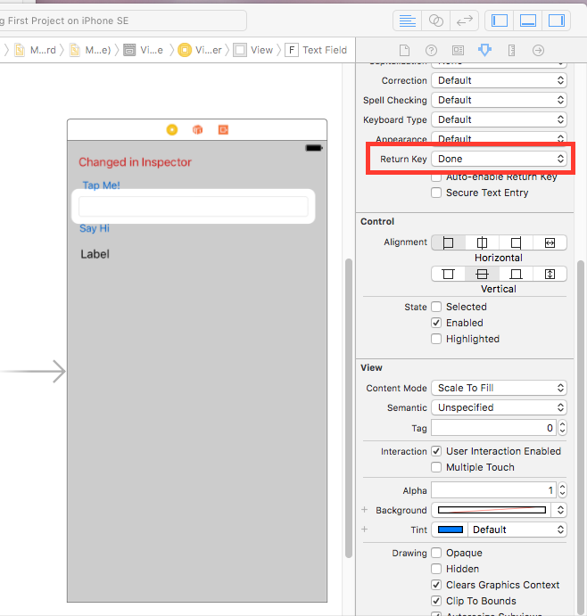
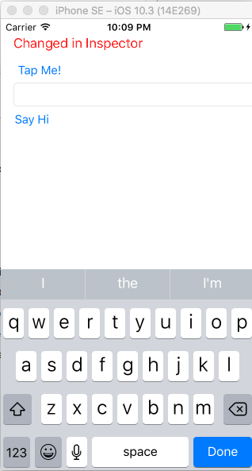
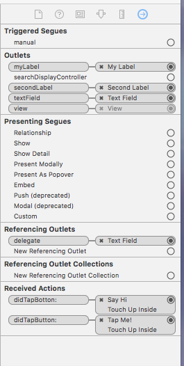

# Learn iOS Notes 

These are the notes taken from the iOS Development series from Lynda. 

`Shift + command + h` = keys to press to navigate to the home page of the Simulator 

<span style="color:blue">some *blue* text</span>

## Creating a Project 
* The Bundle Identifier is how your app is able to be found when it is published to the app store. 

**Main.storyboard** is the GUI layout 

Uses the MVC (Model-View-Controller) design pattern.

### MVC 
* **Model** - represents the data
* **View** - the visual part of the project 
* **Controller** - the object that connects the view to the model 

You can connect an element that you make in the View to the code by viewing the icon with the intersecting circles in the upper right hand corner. You click `Ctrl` click on the item and drag it to the right side of the code. 

Below is where the code that goes for anything that you want to be shown when the application loads. 

```
override func viewDidLoad() {
        super.viewDidLoad()
        myLabel.text = "Changed text on screen" 
    }
```

## Creating Button Actions 

If you want a button to be able to do something, you creat an **action**. 

## Variables 
By creating a variable with an exclamation point **(!)** at the end, we are setting the value to null (no value). 

Example: `@IBOutlet weak var myLabel: UILabel!`

* IB = Interface Builder - what was used to build the GUI seperately 

You can have a question mark **(?)** around it, means that it is a wrapper. If you want to be able to access the actual variable value you have to unwrapp the wrapper with some extra code. 

* **var** - if the variable is going to change 
	* `var age`
* **let** - if the variable is a constant 
	* `var name`

* Outlets create variables 
* Actions create methods 


### Delegation 
**Delegation** is where one object delegates the handling of its events to another object 

You have to flag a class as being able to have a delagate. We can have the keyboard disappear by having the user click on the "Return" key in the lower right hand corner. Or we can go to the **Main.storyboard** view click on the ticker symbol and find the fiel that says **Return Key**, we can then change it to "Done". Below is an image of where you would find the button. 




## Troubleshooting connections 
The circle icons on the left of the line in teh ViewController view should be filled. If it is not filled, then it means that there is no connection to that outlet. 

Can go to the **Main.storyboard** view to see the items with connections that will show in the "Outlet" section in the upper right hand corner. 

It will have the image of the right arrow in the circle and click on the view controller in the GUI. 



## Planning an Application 
 